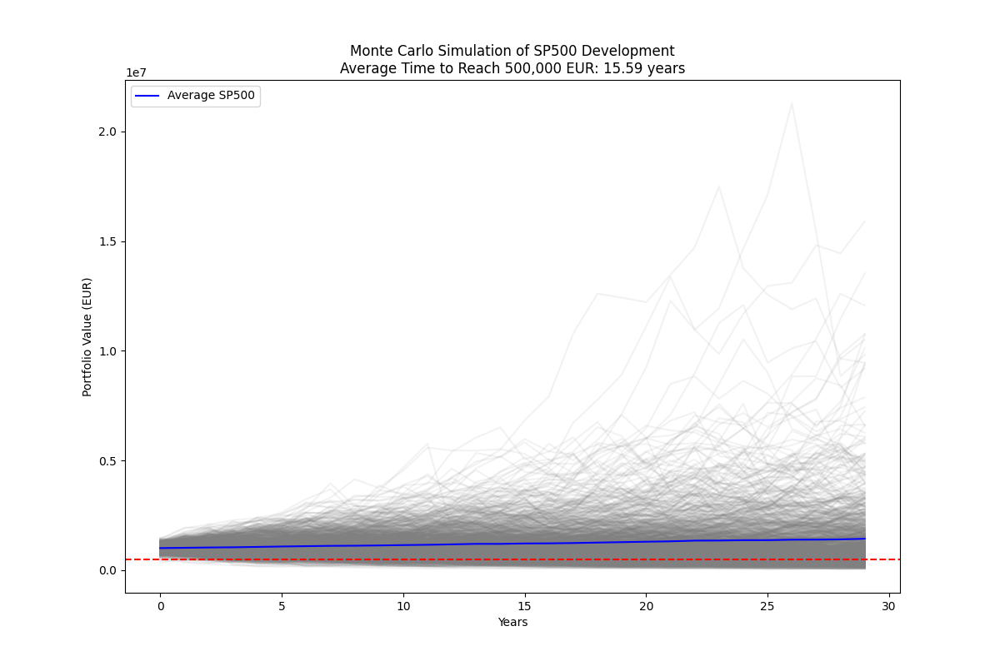
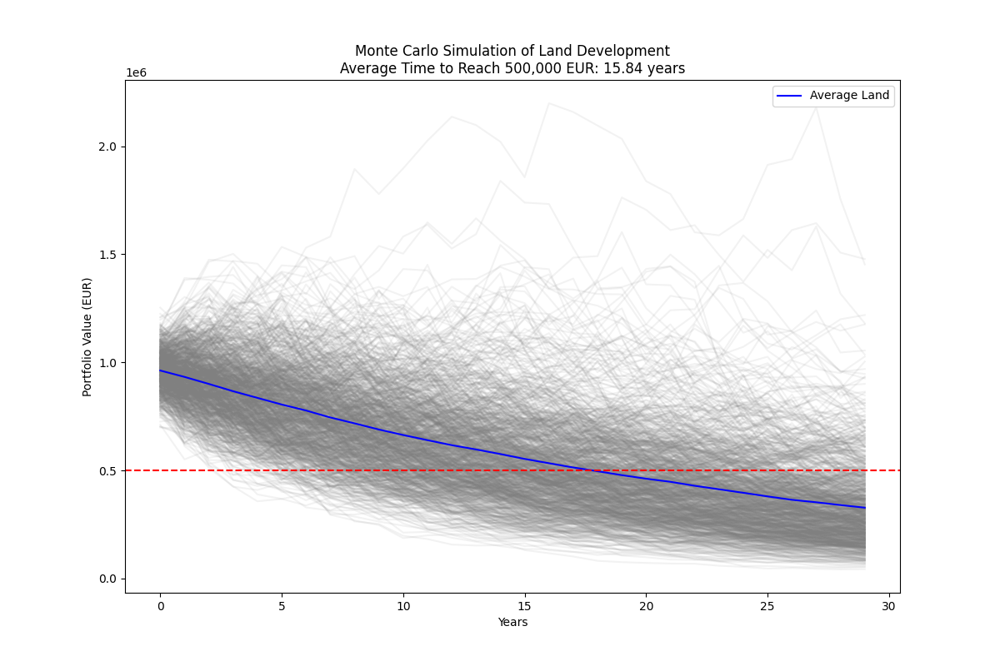
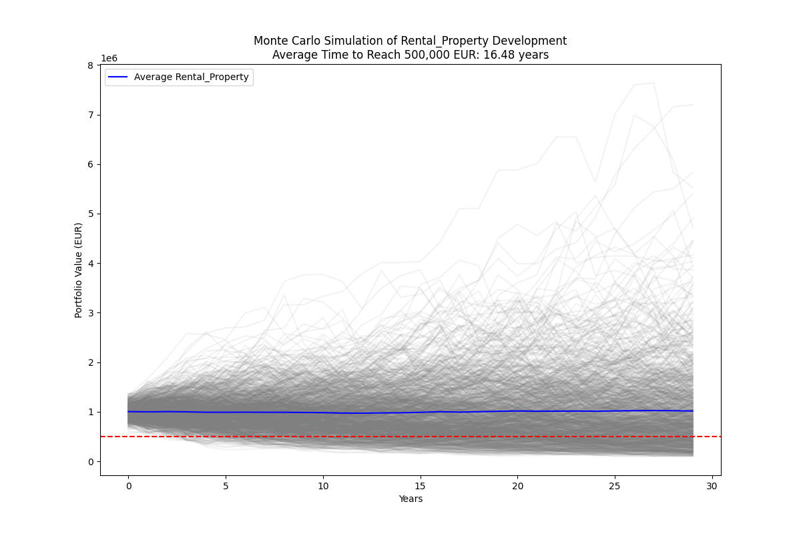
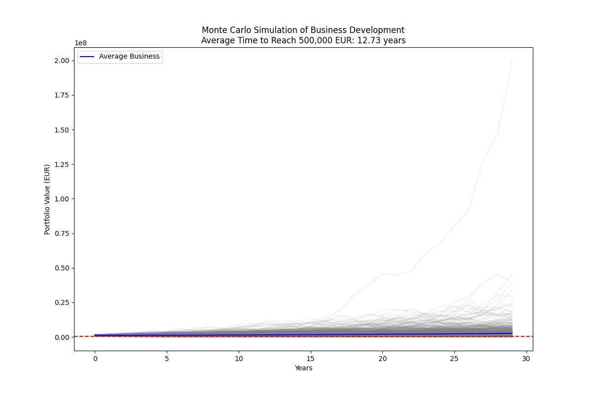
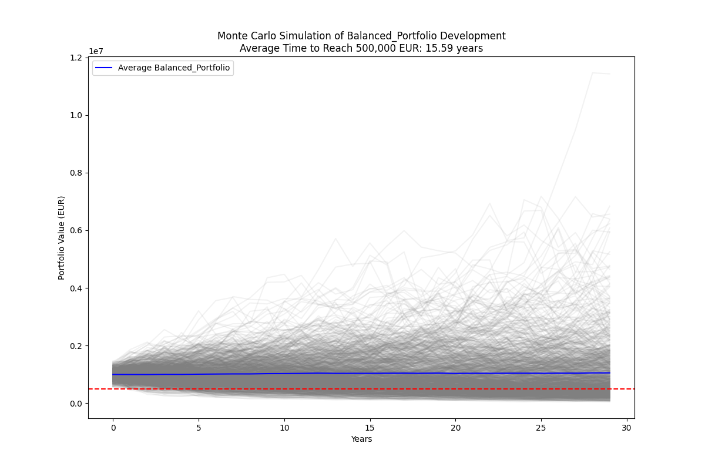

# Dan ze superbohatstvi

Zelení navrhují daň ze superbohatství.

Zkusil jsem namodelovat, jak by se s jejich návrhem bohatství vyvíjelo

Portfolio 1000,000 EUR
Inflace 3 %
Daň z majetku 3.5 %

Zajímá mě, jaká bude za 30 let návratnost pro mě osobně, kolik % z toho zachytí stát v inflaci a kolik ve wealth tax. Zajímá mě, kolik let trvá, než se hodnota mého portfolia změnší na polovinu.

Použil jsem 4 assety + balancované portfolio:

* SP500: {"return": 0.08, "std_dev": 0.18},
* Land: {"return": 0.03, "std_dev": 0.10},
* Rental_Property: {"return": 0.07, "std_dev": 0.15},
* Business: {"return": 0.10, "std_dev": 0.25},
* Balanced_Portfolio: {"return": (0.08 + 0.03 + 0.07 + 0.10) / 4, "std_dev": (0.18 + 0.10 + 0.15 + 0.25) / 4}  # Average return and standard deviation

U riskantnějších assetů jsem dal vyšší std_dev. ROI i volatilita by se daly dosadit přesně, ale hádám, že by to to hlavní (výsledky - tedy masivní propad kapitálu a masivní zdanění, které nezachytává jen interest, ale i ten kapitál, v řádu cca 10 let) nezměnilo.

# Vysledky

## Asset: SP500
  - Average return over 30 years: 42.87%
  - Average time to reach 500,000 EUR: 15.59 years
  - Total wealth tax collected: 1318187.37 EUR (92.27% of total value created)
  - Total impact of inflation: 1164819.47 EUR (81.53% of total value created)

## Asset: Land

  - Average return over 30 years: -67.25%
  - Average time to reach 500,000 EUR: 15.84 years
  - Total wealth tax collected: 645771.45 EUR (197.20% of total value created)
  - Total impact of inflation: 570637.51 EUR (174.25% of total value created)

## Asset: Rental_Property

  - Average return over 30 years: 1.51%
  - Average time to reach 500,000 EUR: 16.48 years
  - Total wealth tax collected: 1087654.65 EUR (107.14% of total value created)
  - Total impact of inflation: 961108.68 EUR (94.68% of total value created)

## Asset: Business

  - Average return over 30 years: 155.11%
  - Average time to reach 500,000 EUR: 12.73 years
  - Total wealth tax collected: 1794220.27 EUR (70.33% of total value created)
  - Total impact of inflation: 1585467.10 EUR (62.15% of total value created)

## Asset: Balanced_Portfolio

  - Average return over 30 years: 4.94%
  - Average time to reach 500,000 EUR: 15.59 years
  - Total wealth tax collected: 1116084.34 EUR (106.35% of total value created)
  - Total impact of inflation: 986230.63 EUR (93.98% of total value created)